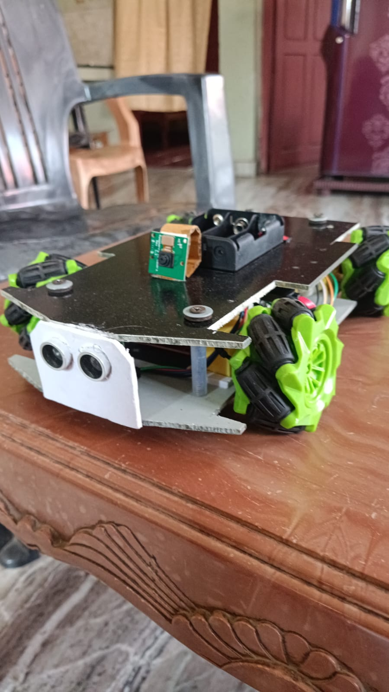
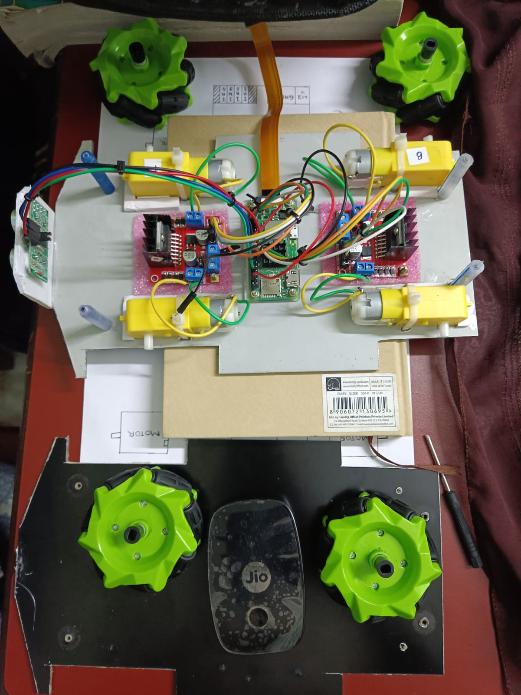
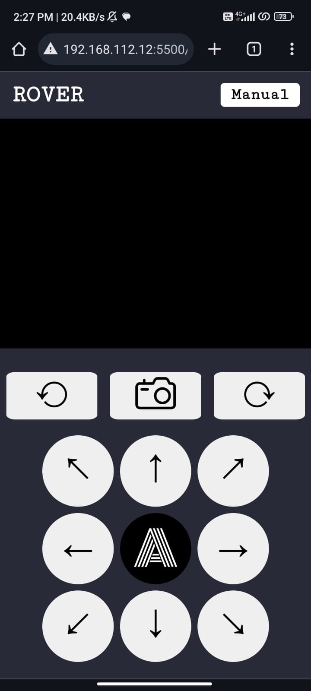

⚠️ Note:
This project was developed during college by a group of amateurs, and as such, it lacks professional coding practices. The entire codebase was written in a single Python file using the Flask framework — yes, you read that right. It was not modularized, and we understand this may be painful to experienced developers. 😅

The code is provided inside `/src`. In that `run_neko.py` is the original version of the code which uses *pygame library* which maps keyboard keys for control. This is the code which is documented inside the project report [alkeak.pdf](./alkeak.pdf) — the name of the pdf is a mashup of our team initials. The same code can be found from page 47 of the pdf.

We later build an application which is an HTML-based remote control interface connecting to a local Flask server. This was its final implementation and can be found in `/src/Neko_Appli`. Note that this was not documented inside the project report. You can see its working in the test videos

---

# Raspberry Pi-Based Remote Vehicle 🚗📷

A remote-controlled, web-based robotic vehicle built using **Raspberry Pi Zero 2W** and controlled via a Flask server. This project was developed as part of a college IoT initiative and showcases integration of multiple hardware components with real-time video streaming and autonomous mode capabilities.

---

## 🔧 Tech Stack

- **Hardware:**

  - Raspberry Pi Zero 2W
  - 2 x L298N Motor Driver
  - 4 x DC Motor
  - US-100 Ultrasonic Sensor
  - Pi Camera Module
  - 4 x Mecanum Wheels

- **Software:**
  - Python
  - Flask
  - HTML/CSS (for web UI)
  - SSH (headless access)

---

## 🎯 Features

- **Remote Vehicle Control:** Navigate the vehicle from a browser-based interface.
- **Real-Time Video Feed:** View live camera feed directly in the browser.
- **Photo Capture:** Take snapshots from the Pi Camera.
- **Autonomous Mode:** Enable obstacle detection and distance-based stopping using the ultrasonic sensor.
- **Omnidirectional Movement:** Mecanum wheel integration allows sideway and diagonal motion.
- **Wireless Operation:** SSH-controlled, headless setup without a display.

## 📸 UI & Functionality

### 🎥 Working Demo Videos (YouTube Shorts)
- [GPIO signal input test](https://youtube.com/shorts/jVpSwBFa7yA)  
- [Multi-direction motor test](https://youtube.com/shorts/kTXw2DsOj0Q)  
- [Vehicle overview](https://youtube.com/shorts/OGs8hdUkN4c)  
- [Vehicle running test](https://youtube.com/shorts/5wiNGcdAIT0)  
- [Obstacle avoidance (Auto Mode)](https://youtube.com/shorts/7-tOotN-keU)

---
