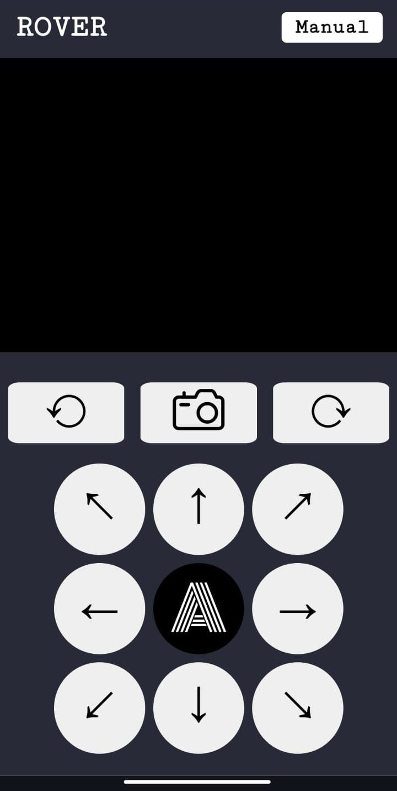

⚠️ Note:
This project was developed during college by a group of amateurs, and as such, it lacks professional coding practices. The entire codebase was written in a single Python file using the Flask framework — yes, you read that right. It was not modularized, and we understand this may be painful to experienced developers. 😅

Unfortunately, the original code has been lost and is no longer available. If I manage to recover it from an old backup (I vaguely remember storing it somewhere), I’ll update the repository.

In the meantime, you can refer to the project report [alkeak.pdf](./alkeak.pdf) — the name is a mashup of our team initials. Check out page 47 for a one-page snapshot of the code. Do note: this isn't the final implementation (we later built an HTML-based remote control interface connected to Flask), but it’s fairly close in spirit.

---

# Raspberry Pi-Based Remote Vehicle 🚗📷

A remote-controlled, web-based robotic vehicle built using **Raspberry Pi Zero 2W** and controlled via a Flask server. This project was developed as part of a college IoT initiative and showcases integration of multiple hardware components with real-time video streaming and autonomous mode capabilities.

---

## 🔧 Tech Stack

- **Hardware:**

  - Raspberry Pi Zero 2W
  - L298N Motor Driver
  - US-100 Ultrasonic Sensor
  - Pi Camera Module
  - Mecanum Wheels

- **Software:**
  - Python
  - Flask
  - HTML/CSS (for web UI)
  - SSH (headless access)

---

## 🎯 Features

- **Remote Vehicle Control:** Navigate the vehicle from a browser-based interface.
- **Real-Time Video Feed:** View live camera feed directly in the browser.
- **Photo Capture:** Take snapshots from the Pi Camera.
- **Autonomous Mode:** Enable obstacle detection and distance-based stopping using the ultrasonic sensor.
- **Omnidirectional Movement:** Mecanum wheel integration allows sideway and diagonal motion.
- **Wireless Operation:** SSH-controlled, headless setup without a display.

## 📸 UI & Functionality

### 🎥 Demo Videos (YouTube Shorts)
- [GPIO signal input test](https://youtube.com/shorts/jVpSwBFa7yA)  
- [Multi-direction motor test](https://youtube.com/shorts/kTXw2DsOj0Q)  
- [Vehicle overview](https://youtube.com/shorts/OGs8hdUkN4c)  
- [Vehicle running test](https://youtube.com/shorts/5wiNGcdAIT0)  
- [Obstacle avoidance (Auto Mode)](https://youtube.com/shorts/7-tOotN-keU)

---